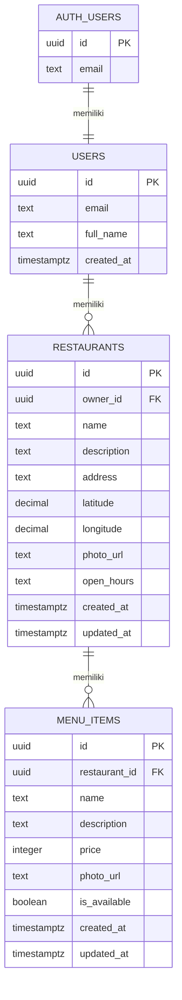

# ERD dan API NearBite

Dokumen ini menjadi rujukan skema backend dan endpoint yang dipakai README utama.

## ERD Konseptual



## Skema SQL Minimum

> Sesuaikan tipe/constraint dengan migration Supabase yang dipakai pada project. `seed_data.sql` hanya berisi data awal, bukan migration lengkap.

```sql
-- 1. Tabel profil pengguna
create table if not exists public.users (
id uuid primary key default gen_random_uuid(),
email text not null unique,
password_hash text, -- kosongkan bila memakai Supabase Auth
full_name text not null,
created_at timestamptz not null default now()
);


-- 2. Tabel resto
create table if not exists public.restaurants (
id uuid primary key default gen_random_uuid(),
owner_id uuid not null references public.users(id) on delete cascade,
name text not null check (char_length(name) >= 3),
description text default '',
address text default '',
latitude double precision not null check (latitude between -90 and 90),
longitude double precision not null check (longitude between -180 and 180),
photo_url text,
open_hours text,
created_at timestamptz not null default now(),
updated_at timestamptz not null default now()
);

-- 3. Tabel menu
create table if not exists public.menu_items (
id uuid primary key default gen_random_uuid(),
restaurant_id uuid not null references public.restaurants(id) on delete cascade,
name text not null check (char_length(name) >= 1),
description text default '',
price integer not null check (price >= 0),
photo_url text,
is_available boolean not null default true,
created_at timestamptz not null default now()
);

-- 4. Index untuk pencarian & join
create index if not exists idx_menu_items_restaurant on public.menu_items(restaurant_id);
create index if not exists idx_restaurants_owner on public.restaurants(owner_id);
create index if not exists idx_restaurants_name on public.restaurants(lower(name));
create index if not exists idx_menu_items_name on public.menu_items(lower(name));


```

## RLS Minimum

Aktifkan RLS dan sesuaikan policy dengan kebutuhan deployment. Inti policy owner adalah `owner_id = auth.uid()` atau restaurant yang dimiliki oleh user aktif.

```sql
alter table public.users enable row level security;
alter table public.restaurants enable row level security;
alter table public.menu_items enable row level security;

create policy "public can read restaurants"
on public.restaurants for select using (true);

create policy "owner can manage restaurant"
on public.restaurants for all
using (owner_id = auth.uid())
with check (owner_id = auth.uid());

create policy "public can read menu items"
on public.menu_items for select using (true);

create policy "owner can manage menu items"
on public.menu_items for all
using (
  exists (
    select 1 from public.restaurants r
    where r.id = menu_items.restaurant_id
      and r.owner_id = auth.uid()
  )
)
with check (
  exists (
    select 1 from public.restaurants r
    where r.id = menu_items.restaurant_id
      and r.owner_id = auth.uid()
  )
);
```

## API Contract

Base URL:

```text
https://<project-ref>.supabase.co
```

Headers umum REST:

```http
Content-Type: application/json
apikey: <SUPABASE_ANON_KEY>
Authorization: Bearer <access_token>  # operasi owner
```

### Auth

| Method | Endpoint | Kegunaan |
|---|---|---|
| POST | `/auth/v1/signup` | Register email/password dan metadata nama |
| POST | `/auth/v1/token?grant_type=password` | Login dan memperoleh access token |
| GET | `/auth/v1/user` | Validasi token/session tersimpan |

### Restaurants

| Method | Endpoint | Kegunaan |
|---|---|---|
| GET | `/rest/v1/restaurants?select=*` | Daftar restoran publik |
| GET | `/rest/v1/restaurants?select=*&id=eq.<id>` | Detail restoran |
| GET | `/rest/v1/restaurants?select=*&owner_id=eq.<user_id>` | Restoran milik owner |
| POST | `/rest/v1/restaurants` | Membuat profil restoran |
| PATCH | `/rest/v1/restaurants?id=eq.<id>` | Memperbarui profil restoran |

### Menu

| Method | Endpoint | Kegunaan |
|---|---|---|
| GET | `/rest/v1/menu_items?select=*` | Data menu untuk pencarian publik |
| GET | `/rest/v1/menu_items?select=*&restaurant_id=eq.<id>` | Menu restoran tertentu |
| POST | `/rest/v1/menu_items` | Menambah menu owner |
| PATCH | `/rest/v1/menu_items?id=eq.<id>` | Mengubah menu owner |
| DELETE | `/rest/v1/menu_items?id=eq.<id>&restaurant_id=eq.<restaurant_id>` | Menghapus menu owner |

## Pemetaan Kode

- Auth: [auth_api_client.dart](lib/features/auth/data/remote/auth_api_client.dart)
- Restaurant/menu API: [restaurant_api_client.dart](lib/features/restaurants/data/remote/restaurant_api_client.dart)
- Model: `lib/features/auth/domain/user.dart`, `lib/features/restaurants/domain/restaurant.dart`, dan `lib/features/restaurants/domain/menu_item.dart`
- Seed data: [seed_data.sql](seed_data.sql)
